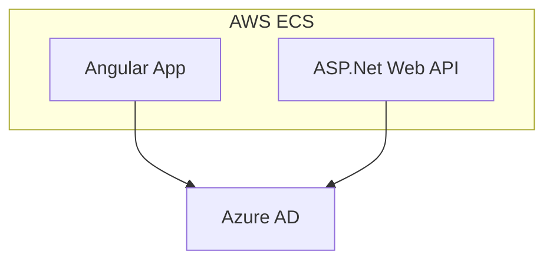

# Overview

The AAAA Stack is a modern web development stack that leverages a combination of powerful technologies to build scalable and robust applications. It is especially popular for building enterprise line of business applications.

## Components of the Stack

| Technology      | Description                    |
| --------------- | ------------------------------ |
| Angular         | Front-end framework            |
| ASP.Net Web API | Back-end framework             |
| AWS             | Cloud service provider         |
| Azure AD        | Identity and access management |

Below is a brief description of each technology used in the stack:

- **Angular**: A front-end framework by Google for building dynamic single-page applications (SPAs) with features like two-way data binding and dependency injection.

- **ASP.Net Web API**: A .NET framework for creating RESTful APIs, known for its simplicity and performance.

- **AWS**: A cloud platform by Amazon offering services like computing power and storage. AWS Fargate allows running containers without managing servers, providing seamless scaling and security.

- **Azure AD**: Microsoft's cloud-based identity and access management service, offering single sign-on (SSO), multi-factor authentication (MFA), and integration with third-party applications.
