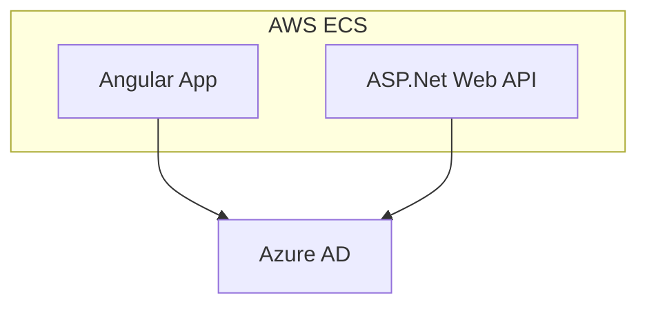

# Overview

The AAAA Stack is a modern web development stack that leverages a combination of powerful technologies to build scalable and robust applications. It is especially popular for building enterprise line of business applications.

## Components of the Stack

| Technology      | Description                    |
| --------------- | ------------------------------ |
| Angular         | Front-end framework            |
| ASP.Net Web API | Back-end framework             |
| AWS             | Cloud service provider         |
| Azure AD        | Identity and access management |

## High Level Design

## Technology Overview

- **Angular**: A front-end framework by Google for building dynamic single-page applications (SPAs) with features like two-way data binding and dependency injection.

  - **MSAL.js**: A library for JavaScript applications to authenticate users with Azure AD and obtain tokens for API access. [Learn more](https://github.com/AzureAD/microsoft-authentication-library-for-js)
  - **Angular Material**: A UI component library for Angular, providing modern and responsive design elements. [Learn more](https://material.angular.io/)

- **ASP.Net Web API**: A .NET framework for creating RESTful APIs, known for its simplicity and performance.

  - **ASP.NET Core Identity**: The API uses JWT (JSON Web Tokens) sent from the front end for authentication and authorization. This approach ensures secure communication between the front end and back end, leveraging token-based authentication to protect APIs with various scope and role-based authorization techniques. [Learn more](https://learn.microsoft.com/en-us/aspnet/core/security/authentication/identity)

- **AWS**: A cloud platform by Amazon offering services like computing power and storage. AWS Fargate allows running containers without managing servers, providing seamless scaling and security. The following services will be used:

  - **Amazon Elastic Container Service with Fargate (Amazon ECS)**: Used to host the front-end and back-end.
  - **Amazon Elastic Container Registry (ECR)**: Used to store and deploy our docker images.
  - **AWS Lambda**: For event processing, configured with permissions to invoke protected back-end APIs.
  - **AWS CDK**: For infrastructure as code with TypeScript.

- **Azure AD (Entra ID)**: Microsoft's cloud-based identity and access management service.
  - Single sign-on (SSO)
  - Fine grained user and app permissions for front-end, back-end, and daemon apps with application scope and roles.

## CI / CD

**GitHub Actions** is used to automate your build, test, and deployment pipeline. This powerful CI/CD tool allows you to define workflows that can build, test, and deploy your application whenever changes are pushed to your repository.

By leveraging GitHub Actions, you can ensure a consistent and reliable process for delivering your applications.

## FAQ

### Why the name 'AAAA'?

It's an acronym for Angular, ASP.Net, AWS, and Azure AD.  We will also use A4 interchangeably. Also, I couldn't find a better name, so here we are!

### Where is the Database?

You can use any database with the AAAA Stack. The choice of database depends on your specific requirements and preferences. Popular options include SQL databases like Microsoft SQL Server or PostgreSQL, and NoSQL databases like MongoDB or DynamoDB. Detailed documentation for integrating these databases with the stack is available, but it is beyond the scope of this example. Also, I couldn't find a database starting with 'A'. 🙂
